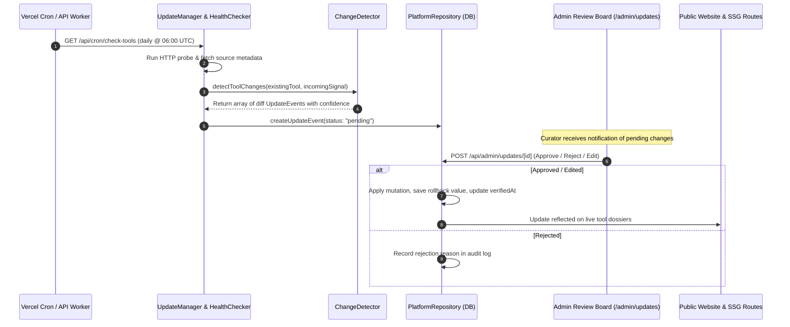

# Creator by Amusemac — Automated Update Engine & Review Architecture

**Platform:** Creator by Amusemac  
**System:** Non-Destructive Auto-Update & Human-in-the-Loop Review System  
**Version:** 1.0.0-Automation  
**Date:** August 2026  

---

## 1. System Overview & Ingestion Flow

The automated update architecture ensures that Creator by Amusemac maintains up-to-date tool specs, pricing tiers, and model releases without ever automatically publishing unverified or fabricated data to the public website.

---

## 2. 10 Core Automation Safety Principles

1. **Evidence Precondition:** No update event is created without a verifiable `sourceUrl` and HTTP provenance.
2. **Never Overwrite Blindly:** All incoming differences generate isolated `UpdateEvent` records rather than direct database mutations.
3. **Preserve Rollback State:** Every applied mutation archives the exact `previousValue` in `rollbackValue`.
4. **Mandatory Human Review for Critical Fields:** Pricing, commercial licensing terms, and core capability removals always require manual editorial approval (`status: "pending"`).
5. **Confidence Scoring:** Changes are assigned a `confidenceScore` (0.0 to 1.0) based on source publisher domain match and schema validation.
6. **Graceful Network Degradation:** Failed HTTP probes or timeouts never delete or mark tools offline; they record an unreachable status in the source ledger without altering public pages.
7. **Idempotent Cron Execution:** Running cron workers multiple times produces no duplicate update events or race conditions.
8. **Staleness Tracking:** Records unverified for $>14$ days are automatically surfaced in the Admin Staleness Monitor.
9. **Separate Verified vs Editorial Content:** Factual benchmarks (pricing, platforms, models) are tracked separately from qualitative editorial ratings.
10. **Zero Public Breakage:** Ingestion failures or unhandled external website structural changes never throw runtime exceptions on public Next.js pages.

---

## 3. Scheduled Background Jobs

Configured in `vercel.json`:

| Job Route | Frequency | Purpose | Idempotent |
|---|---|---|---|
| `/api/cron/check-tools` | Daily (`0 6 * * *`) | Probes official tool endpoints, checks domain health, and ingests pricing/model signals. | Yes |
| `/api/cron/detect-stale` | Weekly (`0 12 * * 1`) | Identifies tools whose last manual verification exceeds the 14-day threshold. | Yes |
| `/api/cron/refresh-index` | Daily (`0 0 * * *`) | Re-generates tokenized multi-entity search payloads and facet weights. | Yes |

*Security:* All cron routes verify the `Authorization: Bearer <CRON_SECRET>` header.

---

## 4. Admin Review Workflow & User Interface

Accessible at `/admin` and `/admin/updates`:

- **Visual Side-by-Side Diff Viewer:** Compares live `- Previous Value` (red highlight) against `+ Proposed New Value` (emerald highlight).
- **One-Click Actions:**
  - **Approve & Apply:** Applies the field change atomically, updates `verifiedAt` to today, records audit log.
  - **Reject:** Dismisses false positives with optional editorial rejection notes.
  - **Edit & Apply:** Opens an inline editor allowing curators to adjust copy before committing to production.
- **Source Ledger (`/admin/sources`):** Provides a transparent audit trail of all upstream links, publishers, and reliability ratings.
