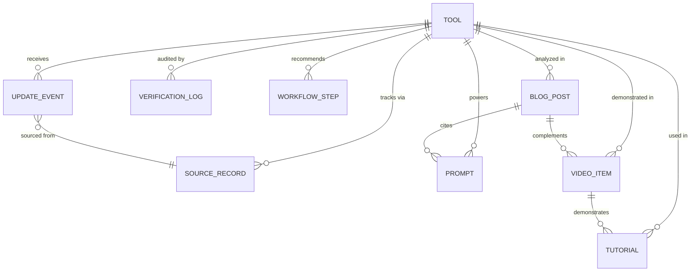

# Creator by Amusemac — Data Backend Architecture

**Platform:** Creator by Amusemac  
**Type:** Scalable Creator Data, Media & Verification Architecture  
**Version:** 2.0.0-Data  
**Date:** August 2026  

---

## 1. Executive Summary & Database Evaluation

To evolve Creator by Amusemac into an automated, multi-modal creator intelligence engine, the data layer has been structured around a **Unified Repository Pattern (`lib/db/repository.ts`)**.

### Database Provider Evaluation for Next.js 16 + Vercel

| Criteria | Supabase PostgreSQL | Neon PostgreSQL | Vercel Postgres |
|---|---|---|---|
| **Architecture** | Managed Postgres + Auth + Storage | Serverless Branching Postgres | Serverless Edge Postgres |
| **Edge Compatibility** | Excellent via `@supabase/ssr` & Connection Pooler | Excellent via `@neondatabase/serverless` | Native Vercel integration |
| **JSONB Support** | Full JSONB indexing for variable prompts & diff history | Full JSONB indexing | Full JSONB indexing |
| **Zero-Cold-Start** | Supported via HTTP pooling | Scale-to-zero with HTTP query driver | Scale-to-zero native |
| **Recommendation** | **Top Choice for Auth/Storage expansion** | **Top Choice for Branching & Staging** | **Top Choice for Frictionless Vercel Deploy** |

**Standardized Strategy:** Standard PostgreSQL connection string (`DATABASE_URL`). The repository layer (`PlatformRepository`) uses an adapter pattern that interfaces seamlessly with any standard PostgreSQL instance while preserving a **zero-dependency static fallback** for instant local builds and SSG pre-rendering.

---

## 2. Core Entity Schemas & Relational Graph

### 2.1 Entity Relationship Model

### 2.2 Entity Schema Definitions

#### 1. `Tool` & `ToolPricing`
- `id` (PK): `tool-runway`, `tool-midjourney`, etc.
- `slug`: URL slug for SEO routing (`runway`, `midjourney`).
- `name`, `tagline`, `description`, `overview`: Editorial descriptions.
- `category` & `subcategories`: Hierarchical creative taxonomy.
- `pricing`: `{ model: "freemium", startingPrice: "$12/mo", freeTierDetails: "...", commercialUse: true }`.
- `supportedModels`: Models array (e.g. `["Gen-3 Alpha", "Act-One"]`).
- `relatedBlogIds` & `relatedVideoIds`: Relational foreign keys.

#### 2. `BlogPost` (Editorial Intelligence)
- `id` (PK): `blog-state-of-gen-video-2026`.
- `slug`: `state-of-generative-video-2026`.
- `title`, `excerpt`, `contentMarkdown`, `coverImageUrl`.
- `author`: `{ name, role, avatarUrl }`.
- `category`, `tags`, `readingTime`.
- `status`: `"draft"` | `"published"`.
- `relatedToolIds`, `relatedPromptIds`, `relatedTutorialIds`, `relatedWorkflowIds`, `relatedVideoIds`, `sourceUrls`.

#### 3. `VideoItem` (Curated Video Breakdowns)
- `id` (PK): `vid-runway-camera-masterclass`.
- `slug`: `runway-gen-3-camera-control-masterclass`.
- `title`, `description`, `platform` (`"youtube"` | `"vimeo"`).
- `videoUrl`, `embedUrl`, `thumbnailUrl`, `duration`.
- `creator`: `{ name, channelUrl, avatarUrl }`.
- `status`: `"draft"` | `"published"`.
- `relatedToolIds`, `relatedPromptIds`, `relatedTutorialIds`, `relatedWorkflowIds`, `relatedBlogIds`.

#### 4. `SourceRecord` (Source Tracking & Provenance)
- `id`: `src-runway-official`, `src-kling-changelog`.
- `url`: Target evidence link.
- `sourceType`: `"official_site"` | `"pricing_page"` | `"changelog"` | `"api_docs"` | `"video_channel"` | `"editorial_blog"`.
- `reliabilityScore`: `0.0` to `1.0`.

#### 5. `UpdateEvent` (Non-Destructive Audit & Rollback)
- `id`, `entityType`, `entityId`, `fieldPath`, `previousValue`, `newValue`, `confidenceScore`, `status`, `rollbackValue`.
