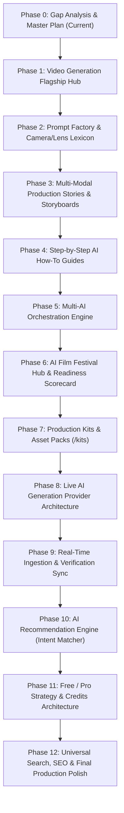

# Creator by Amusemac — Master Product Upgrade Plan V2

**Platform:** Creator by Amusemac  
**Production URL:** [https://creator-amusemac.vercel.app/](https://creator-amusemac.vercel.app/)  
**GitHub Repository:** `https://github.com/jatwa/creator-amusemac.git`  
**Phase:** 0 — Master Phased Implementation Roadmap  
**Date:** August 19, 2026  

---

## 1. Upgrade Philosophy & Non-Destructive Principles

1. **Preserve All Existing Systems:** The 14 existing routes (`/`, `/tools`, `/tools/[slug]`, `/prompts`, `/compare`, `/tutorials`, `/workflows`, `/categories`, `/resources`, `/search`, `/blog`, `/blog/[slug]`, `/videos`, `/videos/[slug]`, `/admin/*`) must remain fully functional and un-broken.
2. **Standardized Dark Cinematic Design:** All new pages and components strictly follow the ink/panel/line/lime design tokens with glassmorphic cards, crisp typography, and mobile responsiveness (390px, 768px, 1440px).
3. **Data Integrity:** No fabricated pricing, model capabilities, or festival deadlines. Every fact is backed by source records and verified timestamps.
4. **Resilient Architecture:** Multi-provider abstractions with server-side API key handling, graceful error states, and zero-downtime fallback.

---

## 2. Phased Implementation Roadmap

---

### Phase 1: Video Generation Flagship Hub (`/categories/video`)
- **Objective:** Transform `/categories/video` into the premier AI video generation intelligence terminal.
- **Key Deliverables:**
  - Director-oriented hero section and cinematic overview.
  - Multi-engine comparison matrix (Runway Gen-3, Kling, Google Veo, Luma Dream Machine, MiniMax/Hailuo, Wan 2.1, Flux).
  - High-dimension filter matrix: Text-to-Video, Image-to-Video, Video-to-Video, Camera Control, Character Consistency, Physics, Lip Sync, Resolutions, Pricing models.
- **Files Modified/Created:** `app/categories/[slug]/page.tsx`, `components/video-hub-matrix.tsx`, `data/types.ts`, `data/platform-data.ts`.
- **Complexity:** Medium | **Live Data:** Yes | **API Key:** No.

---

### Phase 2: Cinematic Prompt Factory & Lexicon (`/prompts/factory`)
- **Objective:** Deliver a modular 5-token cinematic prompt compiler and interactive visual vocabulary dictionary.
- **Key Deliverables:**
  - Token assembler: `[CAMERA RIG & LENS] + [SUBJECT / ACTION] + [LIGHTING / ENVIRONMENT] + [PHYSICS & ATMOSPHERE] + [RENDER / CADENCE]`.
  - Interactive Camera & Lens Lexicon with 1-click token injection (Russian Arm, Vertigo/Zolly, FPV Drone Dive, 35mm Anamorphic, Volumetric Haze, 24fps 180° shutter).
  - Model-Specific Syntax Compiler converting creative intent into syntax-accurate prompts for Runway vs Kling vs Veo vs Luma vs Hailuo vs Open-Source.
- **Files Modified/Created:** `app/prompts/factory/page.tsx`, `components/prompt-factory.tsx`, `components/camera-lexicon.tsx`, `lib/engine/prompt-compiler.ts`.
- **Complexity:** Medium | **Live Data:** No | **API Key:** No.

---

### Phase 3: Multi-Modal Production Stories & Storyboard System (`/stories`)
- **Objective:** Showcase how professional visual storytellers build AI films from concept to final delivery.
- **Key Deliverables:**
  - Stories listing (`/stories`) and deep breakdown pages (`/stories/[slug]`).
  - Flagship production stories: *The Cyberpunk Extraction*, *The Lucid Ride*, *Lost Horizon*.
  - Visual Storyboard Blocks: Shot-by-shot cards (Shots 01–05+) with camera, lens, composition, T2I prompt, T2V prompt, I2V prompt, tools used, and 1-click copy buttons.
  - Explicit multi-stage production pipeline: Stage 1 (T2I Concept Frame) $\rightarrow$ Stage 2 (T2V Environment/Motion) $\rightarrow$ Stage 3 (I2V Character Animation) $\rightarrow$ Stage 4 (Sound/Finishing).
- **Files Modified/Created:** `app/stories/page.tsx`, `app/stories/[slug]/page.tsx`, `components/storyboard-view.tsx`, `data/types.ts`, `data/platform-data.ts`.
- **Complexity:** Medium-High | **Live Data:** No | **API Key:** No.

---

### Phase 4: Step-by-Step AI How-To Guides
- **Objective:** Provide actionable step-by-step masterclasses directly on tool dossier pages.
- **Key Deliverables:**
  - Dedicated "How to Use this AI" interactive guide on tool pages (`/tools/[slug]`).
  - Tiered pathways: Beginner $\rightarrow$ Intermediate $\rightarrow$ Advanced.
  - Covers Runway Gen-3 Alpha, Kling AI, Midjourney v6.1, Flux.1, Descript, ElevenLabs, Topaz Video AI, Ideogram.
  - Common pitfalls, camera prompt syntax cheatsheet, and recommended export settings.
- **Files Modified/Created:** `app/tools/[slug]/page.tsx`, `components/tool-how-to-guide.tsx`, `data/types.ts`.
- **Complexity:** Low-Medium | **Live Data:** Yes | **API Key:** No.

---

### Phase 5: Multi-AI Orchestration Engine
- **Objective:** Visual pipeline planner illustrating multi-model chaining workflows.
- **Key Deliverables:**
  - Orchestration pipeline view linking Idea $\rightarrow$ Script $\rightarrow$ T2I $\rightarrow$ I2V $\rightarrow$ Voice $\rightarrow$ Music $\rightarrow$ Edit $\rightarrow$ Upscale $\rightarrow$ Delivery.
  - Clear Input $\rightarrow$ Tool Adapter $\rightarrow$ Output transitions.
- **Files Modified/Created:** `app/workflows/[slug]/page.tsx`, `components/workflow-orchestrator.tsx`.
- **Complexity:** Medium | **Live Data:** No | **API Key:** No.

---

### Phase 6: AI Film Festival Hub & Readiness Scorecard (`/festivals`)
- **Objective:** Global directory of verified AI film competitions and submission toolkits.
- **Key Deliverables:**
  - Festival hub (`/festivals`) tracking Runway AIFF, Tribeca X AI, Cannes AI Showcase, etc.
  - Live verified deadlines, eligibility rules, accepted toolchains, prize tiers, official submission links, and Schema.org `Event` structured data.
  - Interactive Festival Readiness Scorecard: Configurable compliance checklist (Multi-model disclosure, audio stems, 24fps master export, rights/IP documentation, generation prompt logs).
- **Files Modified/Created:** `app/festivals/page.tsx`, `app/festivals/[slug]/page.tsx`, `components/festival-scorecard.tsx`, `data/types.ts`, `data/platform-data.ts`.
- **Complexity:** Medium | **Live Data:** Yes (verified) | **API Key:** No.

---

### Phase 7: Production Kits & Asset Hub (`/kits`)
- **Objective:** Upgrade `/resources` into a curated creator asset library.
- **Key Deliverables:**
  - Catalog of downloadable production assets: Cinematic LUT packs, Notion film production board templates, pitch deck templates, storyboard templates, shot lists, ComfyUI workflow pipelines.
  - Clear Free vs Pro tier tags and direct download triggers.
- **Files Modified/Created:** `app/kits/page.tsx`, `app/kits/[slug]/page.tsx`, `components/kit-card.tsx`, `data/types.ts`.
- **Complexity:** Medium | **Live Data:** No | **API Key:** No.

---

### Phase 8: Live In-App AI Generation Provider Architecture (`/generate`)
- **Objective:** Establish the modular multi-provider backend and interactive generation lab.
- **Key Deliverables:**
  - Multi-provider abstraction (`lib/engine/ai-providers/`): Provider interface supporting Fal.ai, Replicate, and official APIs.
  - Server-side secret management (`FAL_KEY`) with zero client key leakage.
  - Generation endpoint `/api/generate/video` with input validation, model whitelisting, and error handling.
  - `DirectGenerationWidget` UI on `/generate` supporting prompt input, image reference upload, aspect ratio, duration, generation progress, and video preview/export.
- **Files Modified/Created:** `app/generate/page.tsx`, `app/api/generate/video/route.ts`, `lib/engine/ai-providers/`, `components/direct-generation-widget.tsx`.
- **Complexity:** High | **Live Data:** Yes | **API Key:** Yes (`FAL_KEY` server-side).

---

### Phase 9: Real-Time Ingestion & Verification Sync
- **Objective:** Connect the live update engine to the new Video Engines, Stories, Festivals, and Kits.
- **Key Deliverables:**
  - Extend `source-collector.ts` to track official festival submission dates and model changelogs.
  - Update admin control center to review and stage festival deadline and video engine changes.
- **Files Modified/Created:** `lib/engine/source-collector.ts`, `lib/db/repository.ts`, `app/admin/sources/page.tsx`.
- **Complexity:** Medium | **Live Data:** Yes | **API Key:** No.

---

### Phase 10: Creator Intent AI Recommendation Engine
- **Objective:** Grounded natural-language intent matcher for creator productions.
- **Key Deliverables:**
  - Structured recommendation synthesizer: Takes project goals, budget, skill level, content type, and desired realism $\rightarrow$ returns recommended tool stack, prompt recipes, storyboard templates, and tutorials.
  - Grounded strictly in current database facts with zero capability hallucinations.
- **Files Modified/Created:** `lib/engine/recommendation-engine.ts`, `components/recommendation-modal.tsx`.
- **Complexity:** Medium | **Live Data:** Yes | **API Key:** No.

---

### Phase 11: Free / Pro Product Strategy & Credits Architecture
- **Objective:** Data models and UI badges for future monetization.
- **Key Deliverables:**
  - Modular Creator Credits balance tracker, generation cost estimator, and usage allowance modeling (without activating live credit card billing).
- **Files Modified/Created:** `lib/db/types.ts`, `data/types.ts`.
- **Complexity:** Medium | **Live Data:** No | **API Key:** No.

---

### Phase 12: Universal Search, SEO & Final Production Polish
- **Objective:** Full cross-entity search indexing and canonical SEO schema.
- **Key Deliverables:**
  - Universal search (`/search`) indexing all 10 entity types (Tools, Prompts, Blogs, Videos, Workflows, Tutorials, Comparisons, Stories, Festivals, Kits).
  - Dynamic XML Sitemap (`/sitemap.xml`) updated with all new canonical URLs.
  - Schema.org structured data (`Event`, `CreativeWork`, `HowTo`, `SoftwareApplication`, `Article`, `VideoObject`).
  - Complete 390/768/1440px mobile responsive QA and production verification.
- **Files Modified/Created:** `lib/search/indexer.ts`, `components/search-view.tsx`, `app/sitemap.ts`.
- **Complexity:** Medium | **Live Data:** Yes | **API Key:** No.

---

## 3. Verification Protocol for Every Phase

Every individual phase will strictly execute the following verification cycle:
1. `npm run typecheck` (Must pass with 0 errors).
2. `npm run build` (Must pre-render all static/dynamic routes with 0 errors).
3. Automated route QA test matrix.
4. Git commit on `main` and push to `https://github.com/jatwa/creator-amusemac.git`.
5. Verify live production deployment on `https://creator-amusemac.vercel.app/`.
