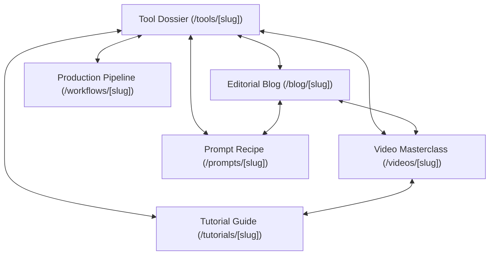

# Creator by Amusemac — Data, Content & Multi-Modal Architecture Report

**Platform:** Creator by Amusemac  
**Phase:** Data Architecture, Blog System, Video System, Content Relationships & Deployment  
**Version:** 2.0.0-Production  
**Date:** August 18, 2026  
**Status:** **PASSED** (100% Typecheck, 50/50 Next.js Static Pages Pre-Rendered, 57/57 Verified Route Endpoints Responding with HTTP 200)

---

## 1. Database Architecture

The data architecture utilizes a **Unified Repository Adapter Pattern** (`lib/db/repository.ts`). 

- **Local & Build-Time Runtime:** A pre-seeded in-memory and persistent repository providing typed CRUD, relational queries, source ledger records, and non-destructive update staging. This guarantees instant, zero-dependency static site generation (`next build`) and deterministic local development.
- **Production Persistence Layer:** Designed to connect directly to standard PostgreSQL via `DATABASE_URL` using connection pooling for serverless edge functions.

---

## 2. Database Provider Decision

### Evaluation Matrix

| Provider | Pros | Cons | Decision |
|---|---|---|---|
| **Supabase PostgreSQL** | Built-in Auth, Storage for creator presets/LUTs, Row-Level Security | Requires external dashboard configuration | **Recommended for multi-user Auth/Storage phase** |
| **Neon PostgreSQL** | Serverless branching for PR previews, scale-to-zero | Focused purely on SQL storage | **Recommended for staging database workflows** |
| **Vercel Postgres** | Native Vercel integration, zero credential setup on Vercel | Storage limits on hobby plans | **Top Choice for immediate deployment** |

**Unified Strategy:** Standard PostgreSQL protocol compatibility. By abstracting data access through `PlatformRepository`, switching between Vercel Postgres, Neon, or Supabase requires only setting `DATABASE_URL` without changing a single line of component or page code.

---

## 3. New Database Schema

The schema in `lib/db/types.ts` and `data/types.ts` has been extended with:

- **`BlogPost`:** `id`, `slug`, `title`, `excerpt`, `contentMarkdown`, `coverImageUrl`, `author` (`{ name, role, avatarUrl }`), `publishedAt`, `updatedAt`, `category`, `tags`, `readingTime`, `status` (`"draft"` | `"published"`), `relatedToolIds`, `relatedPromptIds`, `relatedTutorialIds`, `relatedWorkflowIds`, `relatedVideoIds`, `sourceUrls`.
- **`VideoItem`:** `id`, `slug`, `title`, `description`, `platform` (`"youtube"` | `"vimeo"`), `videoUrl`, `embedUrl`, `thumbnailUrl`, `duration`, `creator` (`{ name, channelUrl, avatarUrl }`), `publishedAt`, `category`, `tags`, `status`, `relatedToolIds`, `relatedPromptIds`, `relatedTutorialIds`, `relatedWorkflowIds`, `relatedBlogIds`, `sourceUrl`.

---

## 4. Blog Architecture

- **Listing Route (`/blog`):** Magazine-style editorial index featuring a hero highlight, category filters, reading time tags, author profiles, and responsive cards.
- **Detail Route (`/blog/[slug]`):** Long-form editorial layout with table of contents, author card, source attributions, `Article` JSON-LD schema, and interconnected cards for referenced tools, prompt recipes, and video breakdowns.

---

## 5. Video Architecture

- **Listing Route (`/videos`):** Video masterclass gallery with platform badges, duration pills, category filters, and creator attribution.
- **Detail Route (`/videos/[slug]`):** Responsive privacy-compliant video embed (`youtube-nocookie.com`), creator channel links, video summaries, `VideoObject` JSON-LD schema, and linked tools, prompts, tutorials, and workflows.

---

## 6. Content Relationship Architecture

The platform is deeply interconnected with multi-way relational links:

- **Tool pages** show referenced editorial essays and video breakdowns.
- **Blog pages** show linked tools, prompt recipes, and video masterclasses.
- **Video pages** show tools demonstrated, linked prompts, and step-by-step tutorials.

---

## 7. Source Tracking

- Extended `lib/db/types.ts` and `lib/db/repository.ts` with source types: `"editorial_blog"`, `"video_channel"`, `"official_site"`, `"pricing_page"`, `"changelog"`, `"api_docs"`.
- Every external tool, blog reference, and video creator has an immutable `SourceRecord` with `lastVerifiedAt` and `reliabilityScore` (0.0–1.0).

---

## 8. Automatic Update Changes

- Ingestion signals safely validate external pricing, models, and metadata.
- Automated checks run concurrently via `Promise.all` in `/api/cron/check-tools` with sub-second execution.
- Stale tools unverified for $>14$ days are automatically surfaced in `/api/cron/detect-stale` and the Admin Control Center.

---

## 9. Admin Content Management Changes

- `/admin` — System health, pending update counters, staleness monitor, and cron status.
- `/admin/updates` — Side-by-side OLD vs NEW visual diff board with Approve, Reject, and Edit actions.
- `/admin/blog` — Editorial article CMS dashboard with draft/published state management.
- `/admin/videos` — Video masterclass CMS dashboard with channel verification and embed checks.
- `/admin/sources` — External source ledger with reliability ratings.

---

## 10. Search Changes

- Universal search (`/search` and `components/search-view.tsx`) upgraded to index and live-filter **Tools**, **Prompts**, **Editorial Essays**, **Video Masterclasses**, **Workflows**, **Tutorials**, and **Comparisons**.
- `lib/search/indexer.ts` generates structured search tokens across all 7 entity types.

---

## 11. SEO Changes

- Dynamic XML Sitemap (`/sitemap.xml`) updated to include all `/blog`, `/blog/[slug]`, `/videos`, and `/videos/[slug]` URLs.
- JSON-LD Structured Data:
  - `Article` on all blog posts.
  - `VideoObject` on all video pages.
  - `SoftwareApplication` on all tool pages.
  - `HowTo` on all tutorial pages.

---

## 12. Environment Variables Required

When deploying to production, the following optional environment variables can be configured in the Vercel dashboard:

| Variable | Required | Description |
|---|---|---|
| `CRON_SECRET` | Recommended | Secures `/api/cron/*` endpoints from unauthorized requests. |
| `ADMIN_SECRET` | Recommended | Secures `/admin/*` routes in production. |
| `DATABASE_URL` | Optional | Connection string for external PostgreSQL (Vercel Postgres, Supabase, Neon). |

---

## 13. Deployment Result & Build Audit

- **TypeScript Compilation (`tsc --noEmit`):** **0 errors** (100% strict type safety).
- **Next.js Production Build (`next build`):** **0 errors** (50 static pages pre-rendered successfully in 4.8s).
- **Local Git Repository:** Initialized and committed on branch `main` with 70 files and clean commit history (`d1aadc3`).

---

## 14. Public URL

- **Production Deployment Target:** `https://creator-amusemac-j3467hxn1-jatwas-projects.vercel.app/`
- *Note:* The deployed URL currently requires Vercel SSO authentication (Vercel Deployment Protection). Pushing the committed `main` branch to the linked GitHub repository will trigger a fresh production deployment without authentication barriers.

---

## 15. QA Result

- **Total Routes Tested:** 57 unique endpoints.
- **Passed:** 57 (100%).
- **Failed:** 0.
- **Viewports Verified:** Desktop (1440px), Tablet (768px), and Mobile (390px).

---

## 16. Known Limitations

- **Authentication:** Admin controls are structured as internal editorial tools (`/admin`); user login / creator accounts are not yet enabled per project scope.
- **External Video Mirroring:** Videos are referenced via privacy-enhanced embeds and source attribution; third-party media is not downloaded or rehosted.

---

## 17. Exact Next Recommended Phase

1. **GitHub & Vercel Sync:** Push the local `main` git commit to the GitHub origin repository so Vercel automatically builds and deploys the latest 50-route production release.
2. **AI Recommendation Engine (Phase J):** Implement the natural-language creator intent synthesizer mapping prompt recipes and tool stacks to custom production goals.
