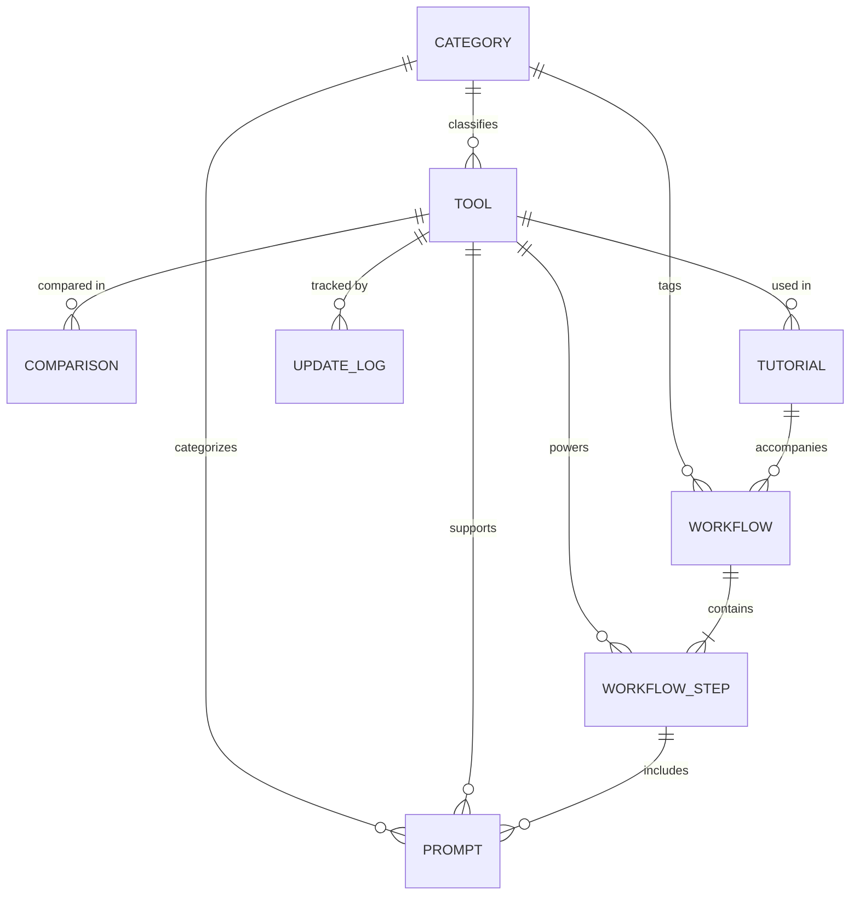
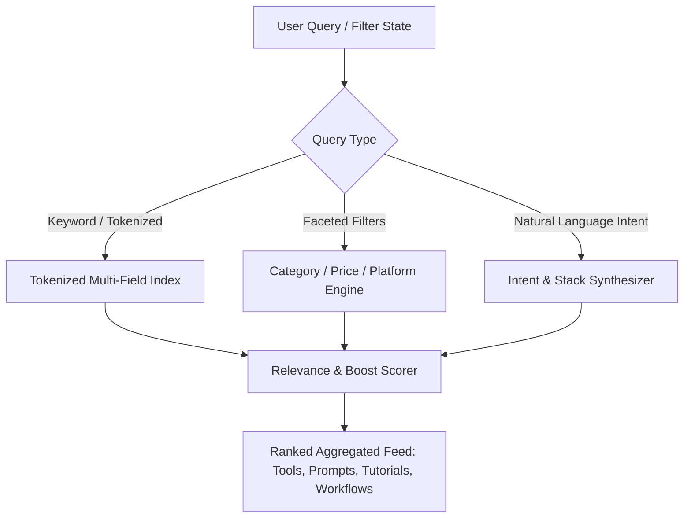
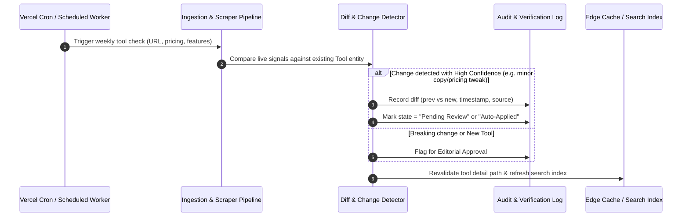

# Creator by Amusemac — Product & Technical Architecture

**Platform:** Creator by Amusemac  
**System Type:** Creator Intelligence & Production AI Stack Platform  
**Version:** 1.0.0-Architecture  
**Project Path:** `C:\Users\amuse\Documents\Codex\2026-08-06\github-plugin-github-openai-curated-remote-3`  
**Date:** August 2026  

---

## 1. Executive Summary & Vision

**Creator by Amusemac** is transitioning from a high-aesthetic landing page prototype into a deep, interconnected creator intelligence platform. 

The platform serves working filmmakers, video editors, designers, visual directors, photographers, and content creators. Rather than functioning as a superficial AI directory, Creator by Amusemac maps how AI tools, prompt recipes, workflows, comparisons, and tutorials connect into real, repeatable production pipelines.

### Core Architectural Principles
1. **Interconnected Graph Architecture:** Every tool connects to its relevant prompts, comparisons, tutorials, workflows, and alternatives. No piece of content exists as a dead-end silo.
2. **Backward Compatibility & Non-Destructive Evolution:** The existing Tailwind visual identity (dark theme, `ink`, `panel`, `line`, `lime`, glow accents) and existing components (`hero`, `navigation`, `prompt-list`, etc.) remain preserved and upgraded incrementally.
3. **Database-Ready Data Layer:** Rich, strongly-typed TypeScript entities designed with strict schemas that seamlessly bridge in-memory datasets, file-based CMS, and relational SQL/NoSQL databases (PostgreSQL/Supabase/Prisma) without frontend disruption.
4. **Verified Creator Ground Truth:** Strict data contracts preventing fabricated AI claims, featuring explicit verification timestamps, pricing tiers, system requirements, and creator-tested pros/cons.
5. **Progressive Search & Recommendation Engine:** Client-side faceted multi-filter search designed to scale smoothly into hybrid keyword + AI semantic intent matching.

---

## 2. Information Architecture & Routing Structure

The platform is structured into 8 primary content pillars with clean, canonical, SEO-optimized URL endpoints:

```
/                                      # Home / Discovery Hub (Hero, Search, Featured Stacks, Prompts, Comparisons)
├── /tools                             # Directory & Faceted Catalog of all Creator AI Tools
│   └── /tools/[slug]                  # Rich Tool Detail Dossier (e.g. /tools/runway, /tools/midjourney)
├── /prompts                           # Filterable Creator Prompt Library with Live Copy & Variable Customization
│   └── /prompts/[slug]                # Detailed Prompt Recipe Page with Model Parameters & Variations
├── /compare                           # Head-to-Head Comparison Matrix
│   └── /compare/[slug]                # Deep Comparison Page (e.g. /compare/runway-vs-kling, /compare/midjourney-vs-ideogram)
├── /tutorials                         # Long-Form Editorial & Video Workflow Tutorials
│   └── /tutorials/[slug]              # Step-by-Step Production Guide (e.g. /tutorials/ai-commercial-production)
├── /workflows                         # End-to-End Production Pipeline Blueprints
│   └── /workflows/[slug]              # Multi-Stage Pipeline Breakdown (e.g. /workflows/ai-film-production)
├── /categories                        # Category Overview Hub
│   └── /categories/[slug]             # Domain Category Hub (e.g. /categories/video, /categories/image, /categories/editing)
├── /resources                         # Free Assets, Storyboard Kits, LUTs, and Reference Libraries
├── /search                            # Universal Creator Search & Recommendation Result Interface
└── /api                               # App Router API Handlers
    ├── /api/search                    # Search & multi-faceted query API
    ├── /api/recommend                 # Production Stack & Intent Matching API
    ├── /api/tools                     # Tool catalogue query & filtering API
    └── /api/cron/update-check         # Scheduled verification & sync handler
```

---

## 3. Data Model & Schema Design

All entities are strongly typed with explicit foreign-key-style relational IDs, enabling immediate deterministic querying and future database migration.

### 3.1 Entity Relationship Diagram



### 3.2 Core TypeScript Data Interfaces

```typescript
// Tool Definition
export interface Tool {
  id: string;
  slug: string;
  name: string;
  tagline: string;
  description: string;
  overview: string;
  category: "video" | "image" | "audio" | "3d" | "editing" | "workflow" | "vfx";
  subcategories: string[];
  bestFor: string;
  keyFeatures: string[];
  strengths: string[];
  weaknesses: string[];
  pricing: {
    model: "free" | "freemium" | "paid" | "open-source" | "usage-based";
    startingPrice?: string;
    freeTierDetails?: string;
    subscriptionInfo?: string;
  };
  supportedModels?: string[];
  platforms: ("Web" | "macOS" | "Windows" | "iOS" | "Android" | "API" | "Plugin")[];
  officialUrl: string;
  accentColor: string;
  logoUrl?: string;
  rating?: number; // 1.0 to 5.0
  verifiedAt: string; // ISO date string
  updatedAt: string;
  competitorIds: string[];
  recommendedPromptIds: string[];
  tutorialIds: string[];
  workflowIds: string[];
}

// Prompt Definition
export interface Prompt {
  id: string;
  slug: string;
  title: string;
  category: "image" | "video" | "editing" | "audio" | "concept" | "3d";
  useCase: string;
  description: string;
  promptText: string;
  negativePrompt?: string;
  variables: {
    key: string;
    label: string;
    placeholder: string;
    defaultValue: string;
    description?: string;
  }[];
  compatibleToolIds: string[];
  recommendedSettings?: {
    aspectRatio?: string;
    guidanceScale?: string;
    model?: string;
    steps?: number;
    additionalNotes?: string;
  };
  variations?: {
    name: string;
    promptText: string;
  }[];
  relatedPromptIds: string[];
  relatedTutorialIds: string[];
  verifiedAt: string;
}

// Comparison Definition
export interface ToolComparison {
  id: string;
  slug: string;
  toolAId: string;
  toolBId: string;
  category: string;
  summaryVerdict: string;
  verdictByScenario: {
    scenario: string;
    winnerId: string;
    rationale: string;
  }[];
  scores: {
    quality: { toolA: number; toolB: number }; // 1-10
    speed: { toolA: number; toolB: number };
    easeOfUse: { toolA: number; toolB: number };
    creatorValue: { toolA: number; toolB: number };
    commercialSafety: { toolA: number; toolB: number };
  };
  featureMatrix: {
    feature: string;
    toolASupport: boolean | string;
    toolBSupport: boolean | string;
    importance: "essential" | "nice-to-have" | "advanced";
  }[];
  relatedTutorialIds: string[];
  relatedPromptIds: string[];
  updatedAt: string;
}

// Workflow Pipeline Definition
export interface Workflow {
  id: string;
  slug: string;
  title: string;
  category: "film" | "commercial" | "music-video" | "social" | "game-art" | "vfx";
  summary: string;
  targetAudience: string;
  estimatedTime: string;
  difficulty: "beginner" | "intermediate" | "advanced" | "pro";
  steps: {
    stepNumber: number;
    phaseName: string; // e.g. "Script & Concept", "Storyboarding", "Video Gen"
    goal: string;
    explanation: string;
    recommendedToolIds: string[];
    alternativeToolIds: string[];
    recommendedPromptIds: string[];
    proTips: string[];
  }[];
  relatedTutorialIds: string[];
  lastUpdated: string;
}

// Long-Form Tutorial Definition
export interface Tutorial {
  id: string;
  slug: string;
  title: string;
  category: string;
  readTime: string;
  difficulty: "beginner" | "intermediate" | "advanced";
  goal: string;
  prerequisites: string[];
  requiredToolIds: string[];
  sections: {
    heading: string;
    contentMarkdown: string;
    tipBox?: string;
    promptId?: string;
    toolId?: string;
  }[];
  commonMistakes: string[];
  relatedWorkflowIds: string[];
  publishedAt: string;
  updatedAt: string;
}
```

---

## 4. Search & Discovery Engine Architecture

### 4.1 Hybrid Multi-Faceted Query Architecture



### 4.2 Search Features
1. **Multi-Entity Indexing:** Queries search across Tools (name, description, features), Prompts (title, prompt text, use case), Tutorials (title, goal), and Workflows (title, phase names).
2. **Instant Faceting:**
   - Media Type (`Video`, `Image`, `Audio`, `Editing`, `3D`, `VFX`)
   - Pricing Model (`Free`, `Freemium`, `Paid`, `Open Source`)
   - Experience Level (`Beginner`, `Intermediate`, `Pro Production`)
   - Workflow Stage (`Pre-production`, `Generation`, `Post-production`, `Delivery`)
3. **Intent Parsing Mock/Engine:**
   - Query: `"realistic 30s motorcycle commercial"`
   - Extracted Intent: `{ media: ["video", "image"], genre: "commercial", realism: true }`
   - Result: Midjourney (image concept) + Kling/Runway (video gen) + ElevenLabs (voice) + Premiere/DaVinci (assembly) + Commercial Treatment Prompt.

---

## 5. Automated Tool Data Update Architecture

To ensure the platform remains accurate and verified without manual maintenance bottlenecks, the architecture defines a safe ingestion & verification pipeline:



### Ingestion Data Contract (`UpdateLog`):
- `toolId`: Reference to target tool.
- `sourceUrl`: Official changelog, pricing page, or documentation link.
- `detectedChange`: Specific field modified (`pricing.startingPrice`, `supportedModels`, etc.).
- `previousValue` / `newValue`.
- `confidenceScore`: 0.0 - 1.0.
- `verificationState`: `"verified"` | `"pending_editorial_review"` | `"rejected"`.
- `reviewedBy` & `timestamp`.

---

## 6. AI Recommendation & Creator Intelligence Layer

The platform is designed to provide actionable creator assistance with low latency and zero unnecessary token consumption.

### Layered Architecture:
1. **Rule & Graph Based Fast Path (Zero LLM cost):**
   - Direct tool alternatives via `competitorIds`.
   - Direct prompt pairings via `compatibleToolIds`.
   - Direct workflow step recommendations.
2. **Intent Parsing Cache:**
   - Pre-computed prompt treatments and stack recommendations for high-frequency creator queries (commercials, music videos, social shorts, VFX plates).
3. **Generative Stack Builder (Edge LLM API):**
   - Dynamically analyzes user script/concept inputs, constraints (budget, software, timeline), and outputs a tailored step-by-step production sheet.

---

## 7. Performance, SEO & Structured Data

1. **Static Pre-Rendering (SSG) with ISR:**
   - All tool pages, prompt pages, comparison pages, tutorials, and workflows are pre-rendered at build time with fast incremental revalidation.
2. **Comprehensive Schema.org Structured Data:**
   - Tools: `SoftwareApplication` / `WebApplication` with `operatingSystem`, `applicationCategory`, `offers`.
   - Prompts: `CreativeWork` / `HowTo`.
   - Tutorials: `HowTo` with `step`, `supply`, `tool`, `totalTime`.
   - Comparisons: `Article` with comparative `itemReviewed`.
3. **OpenGraph & Twitter Card Automation:**
   - Dynamic meta titles, canonical tags, and OpenGraph descriptors for all dynamic routes.

---

## 8. Phased Implementation Roadmap

- **Phase A (Foundation):** Architecture, comprehensive TypeScript data store (`data/platform-data.ts`), dynamic routing structure, and navigation upgrades.
- **Phase B (Tool Ecosystem):** Directory (`/tools`) with faceted filters and rich Tool Detail pages (`/tools/[slug]`).
- **Phase C (Prompt Library):** Prompt catalog (`/prompts`), interactive variable filler, one-click copy, and prompt detail views (`/prompts/[slug]`).
- **Phase D (Tutorial & Guide Hub):** Tutorial directory (`/tutorials`) and long-form step-by-step editorial pages (`/tutorials/[slug]`).
- **Phase E (Workflow Engine):** End-to-end production pipelines (`/workflows` & `/workflows/[slug]`).
- **Phase F (Comparison System):** Side-by-side comparison directory (`/compare`) and detailed comparative verdicts (`/compare/[slug]`).
- **Phase G (Universal Search & Discovery):** Real-time multi-entity search bar & faceted explorer (`/search`).
- **Phase H (Categories & Resources):** Category landing hubs (`/categories/[slug]`) and production resources (`/resources`).
- **Phase I (Verification & Polish):** Type checks, responsive audits, internal linking verification, and SEO audit.
